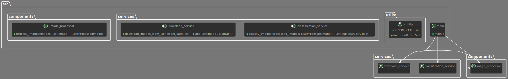

# Fashion Image Analyzer


---

**Fashion Image Analyzer** é uma ferramenta poderosa e de alto desempenho para análise de imagens de moda feminina, construída com Python. Extraia e classifique imagens de moda com facilidade e precisão.

---

## Índice

1. [🚀 Funcionalidades](#-funcionalidades)
2. [📦 Instalação](#-instalação)
   - [Pré-requisitos](#pré-requisitos)
   - [Passos](#passos)
3. [🔧 Configuração](#-configuração)
   - [Parâmetros de Execução](#parâmetros-de-execução)
4. [🛠️ Uso](#️-uso)
   - [Comandos Básicos](#comandos-básicos)
5. [📁 Armazenamento de Dados](#-armazenhamento-de-dados)
   - [Formatos de Saída](#formatos-de-saída)
6. [💡 Boas Práticas](#-boas-práticas)
7. [🤝 Contribuições](#-contribuições)

8. [📊 Visão Geral Executiva](#visão-geral-executiva)
    - [O que é o Fashion Image Analyzer?](#o-que-é-o-fashion-image-analyzer)
    - [Principais Funcionalidades](#principais-funcionalidades)
    - [Casos de Uso](#casos-de-uso)
    - [Benefícios para a Empresa](#benefícios-para-a-empresa)
9. [🔍 Visão Geral Técnica](#visão-geral-técnica)
    - [Arquitetura e Tecnologias Utilizadas](#arquitetura-e-tecnologias-utilizadas)
    - [Componentes Principais](#componentes-principais)
    - [Fluxo de Operação](#fluxo-de-operação)
    - [Destaques Técnicos](#destaques-técnicos)
10. [📘 Manual de Uso do Fashion Image Analyzer](#manual-de-uso-do-fashion-image-analyzer)
    - [Introdução](#introdução)
    - [Instalação](#instalação)
      - [Pré-requisitos](#pré-requisitos-1)
      - [Passos de Instalação](#passos-de-instalação)
    - [Configuração](#configuração-1)
      - [Configuração dos Parâmetros](#configuração-dos-parâmetros)
    - [Uso](#uso-1)
      - [Comandos Básicos](#comandos-básicos-1)
      - [Exemplos de Uso](#exemplos-de-uso)
    - [Armazenamento de Dados](#armazenamento-de-dados-1)
      - [Formatos de Saída](#formatos-de-saída-1)
      - [Exemplo de Arquivo CSV](#exemplo-de-arquivo-csv)
      - [Exemplo de Arquivo JSON](#exemplo-de-arquivo-json)
    - [Boas Práticas](#boas-práticas-1)
    - [Suporte e Contribuição](#suporte-e-contribuição)
11. [📄 Licença](#-licença)
12. [📞 Suporte](#-suporte)

---

## 🚀 Funcionalidades

- **Classificação de Imagens**: Classifique imagens de moda feminina com modelos de aprendizado profundo.
- **Processamento de Imagens**: Redimensione e normalize imagens para melhor precisão na classificação.
- **Armazenamento Flexível**: Salve os dados classificados em formatos JSON.
- **Execução Assíncrona**: Utilize o poder do Python para realizar múltiplas operações de processamento de imagens de forma eficiente.

---

## 📦 Instalação

### Pré-requisitos

- [Python 3.9](https://www.python.org/downloads/release/python-390/)
- [Pip](https://pip.pypa.io/en/stable/installation/)

### Passos

1. **Clone o Repositório:**
   ```
   git clone https://github.com/seu-usuario/fashion-image-analyzer.git
   cd fashion-image-analyzer
   ```

2. **Crie um Ambiente Virtual:**
   ```
   python -m venv venv
   source venv/bin/activate  # No Windows use `venv\Scripts\activate`
   ```

3. **Instale as Dependências:**
   ```
   pip install -r requirements.txt
   ```

---

## 🔧 Configuração

### Parâmetros de Execução

- `jsonl_path`: Caminho para o arquivo JSONL contendo as URLs das imagens.
- `output_path`: Caminho para o arquivo de saída JSONL com as classificações.

---

## 🛠️ Uso

### Comandos Básicos

1. **Executar o Analisador de Imagens:**
   ```
   python src/main.py
   ```

---

## 📁 Armazenamento de Dados

**Formatos de Saída:**

- **JSON:**
  ```
  [
      {
          "url": "http://exemplo.com/imagem1.jpg",
          "classifications": [
              {"class_id": "n123456", "class_name": "dress", "score": 0.95},
              {"class_id": "n654321", "class_name": "skirt", "score": 0.05}
          ]
      },
      {
          "url": "http://exemplo.com/imagem2.jpg",
          "classifications": [
              {"class_id": "n123456", "class_name": "dress", "score": 0.85},
              {"class_id": "n654321", "class_name": "skirt", "score": 0.15}
          ]
      }
  ]
  ```

---

## 💡 Boas Práticas

1. **Verificar o Formato dos Dados:** Certifique-se de que as URLs das imagens estejam no formato correto.
2. **Gerenciar Dependências:** Utilize um ambiente virtual para isolar as dependências do projeto.
3. **Usar de Forma Ética:** Respeite as leis de direitos autorais e privacidade ao baixar e processar imagens.

---

## 🤝 Contribuições

Contribuições são bem-vindas! Siga os passos abaixo para contribuir:

1. Faça um fork do projeto.
2. Crie uma nova branch para sua feature ou correção: `git checkout -b minha-feature`.
3. Commit suas mudanças: `git commit -m 'Adiciona minha nova feature'`.
4. Faça push para a branch: `git push origin minha-feature`.
5. Envie um pull request.

---

## 📊 Visão Geral Executiva

***O que é o Fashion Image Analyzer?***

O Fashion Image Analyzer é uma ferramenta avançada de análise de imagens de moda, projetada para classificar e processar imagens de moda feminina de forma eficiente e automatizada. Este software é capaz de capturar dados de imagens e aplicar modelos de aprendizado profundo para classificá-las em diferentes categorias.

### **Principais Funcionalidades**

**Classificação de Imagens:**

O Fashion Image Analyzer pode classificar imagens de moda em várias categorias, utilizando modelos de aprendizado profundo.

**Processamento de Imagens:**

Os usuários podem processar imagens para melhorar a precisão da classificação, incluindo redimensionamento e normalização das imagens.

**Armazenamento Flexível:**

Os dados classificados podem ser armazenados em formatos JSON, oferecendo flexibilidade para integrações com outras ferramentas de análise de dados e relatórios.

**Desempenho e Escalabilidade:**

Construído com Python e TensorFlow, o Fashion Image Analyzer é capaz de realizar operações complexas de classificação de maneira rápida e eficiente.

### Casos de Uso

**Análise de Tendências de Moda:**

Empresas podem usar o Fashion Image Analyzer para monitorar tendências de moda, coletando dados sobre os tipos de vestuário mais populares.

**Gestão de Conteúdo:**

Plataformas de moda e publicações podem usar a ferramenta para agregar conteúdo de diversas fontes, facilitando a curadoria e publicação de informações.

### Benefícios para a Empresa

**Tomada de Decisão Informada:**

Ao fornecer dados atualizados e detalhados, o Fashion Image Analyzer capacita os tomadores de decisão com insights valiosos que podem influenciar estratégias de negócios.

**Eficiência Operacional:**

Automatizando o processo de análise de imagens, a ferramenta reduz a necessidade de esforços manuais, economizando tempo e recursos.

**Adaptabilidade:**

Com a capacidade de personalizar a classificação e o processamento de imagens, o Fashion Image Analyzer pode ser ajustado para atender a diferentes necessidades e objetivos de negócio.

---

## 🔍 Visão Geral Técnica

### Arquitetura e Tecnologias Utilizadas

**fashion-image-analyzer** é um projeto Python para analisar imagens de moda feminina. Utiliza TensorFlow para classificação de imagens e salva os resultados em formato JSON. O projeto baixa imagens a partir de URLs fornecidas em um arquivo JSONL, processa as imagens e classifica utilizando modelos pré-treinados. O código é organizado em componentes modulares com serviços para download e classificação, seguindo princípios de SOLID e Clean Code para garantir manutenibilidade e escalabilidade.




**Python 3.9:**

Linguagem de programação de alto nível usada para construir a aplicação.

**TensorFlow:**

Biblioteca de aprendizado profundo usada para classificar as imagens.

**Pandas:**

Utilizado para manipulação de dados e armazenamento dos resultados em diferentes formatos.

### Componentes Principais

**Download Service:**

Responsável por baixar as imagens das URLs fornecidas no arquivo JSONL.

**Image Processor:**

Processa as imagens para normalização e preparação para classificação.

**Classification Service:**

Classifica as imagens usando modelos de aprendizado profundo.

### Fluxo de Operação

1. O usuário fornece um arquivo JSONL com as URLs das imagens.
2. O Download Service baixa as imagens.
3. O Image Processor processa as imagens.
4. O Classification Service classifica as imagens.
5. Os resultados são armazenados em um arquivo JSON.

### Destaques Técnicos

- Utilização de modelos pré-treinados do TensorFlow para classificação de imagens.
- Processamento eficiente de imagens usando técnicas de normalização.
- Armazenamento flexível dos resultados em formato JSON.

---

## 📘 Manual de Uso do Fashion Image Analyzer

### Introdução

O Fashion Image Analyzer é uma ferramenta projetada para facilitar a análise e classificação de imagens de moda feminina.

### Instalação

#### Pré-requisitos

- Python 3.9
- Pip

#### Passos de Instalação

1. Clone o repositório.
2. Crie um ambiente virtual.
3. Instale as dependências.

### Configuração

#### Configuração dos Parâmetros

- Caminho para o arquivo JSONL com as URLs das imagens.
- Caminho para o arquivo de saída JSONL com as classificações.

### Uso

#### Comandos Básicos

1. Execute o analisador de imagens com o comando:

   ```
   python src/main.py
   ```


### Armazenamento de Dados

#### Formatos de Saída

- JSON

#### Exemplo de Arquivo JSON

1. Arquivo Json

    ```
    [
        {
            "url": "http://exemplo.com/imagem1.jpg",
            "classifications": [
                {"class_id": "n123456", "class_name": "dress", "score": 0.95},
                {"class_id": "n654321", "class_name": "skirt", "score": 0.05}
            ]
        }
    ]
    ```

---

## 💡 Mais Boas Práticas

- Verifique o formato dos dados.
- Utilize um ambiente virtual para isolar as dependências do projeto.
- Respeite as leis de direitos autorais e privacidade ao baixar e processar imagens.

---

### Suporte e Contribuição

Para suporte adicional, abra uma issue no repositório ou entre em contato com os mantenedores.

---

## 📄 Licença

Este projeto está licenciado sob a licença MIT - veja o arquivo [LICENSE](LICENSE) para mais detalhes.

---

## 📞 Suporte

Para suporte adicional, abra uma issue no repositório ou entre em contato com os mantenedores.

---